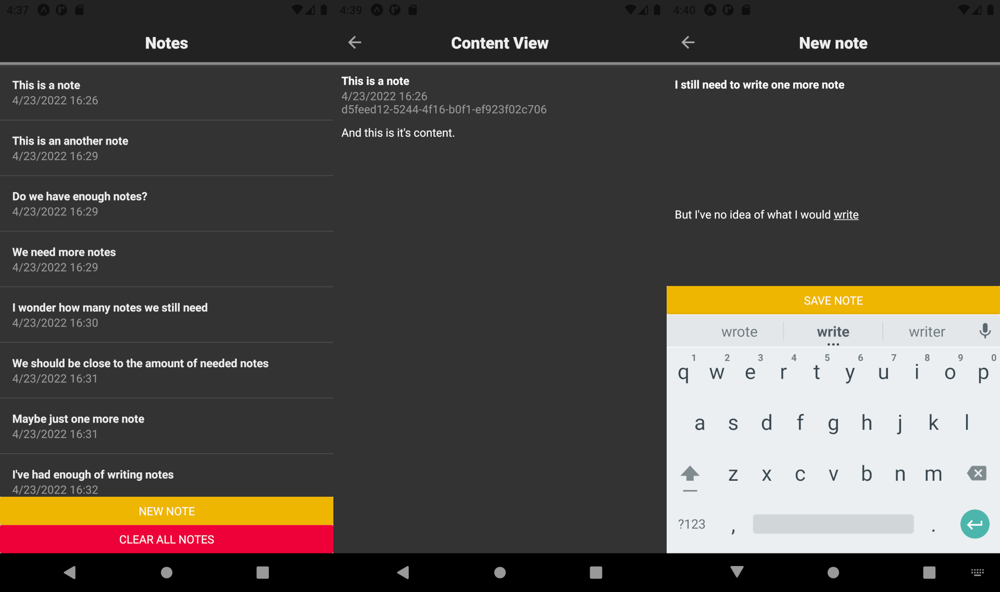

# Web and Mobile Programming 2022
### Part 4 - Expo/React Native notes application

Tested on an iPhone 11 on iOS 15.5b2 and an Android 11 simulator.

Running:
 - The application has been made using Node v16.14.2 and npm v8.7.0. If nvm is installed, `nvm use` can be used in root directory.
 - Run `npm start` after running `npm install` to start the Expo Developer tools. The app can be run from there in different devices or the web browser.